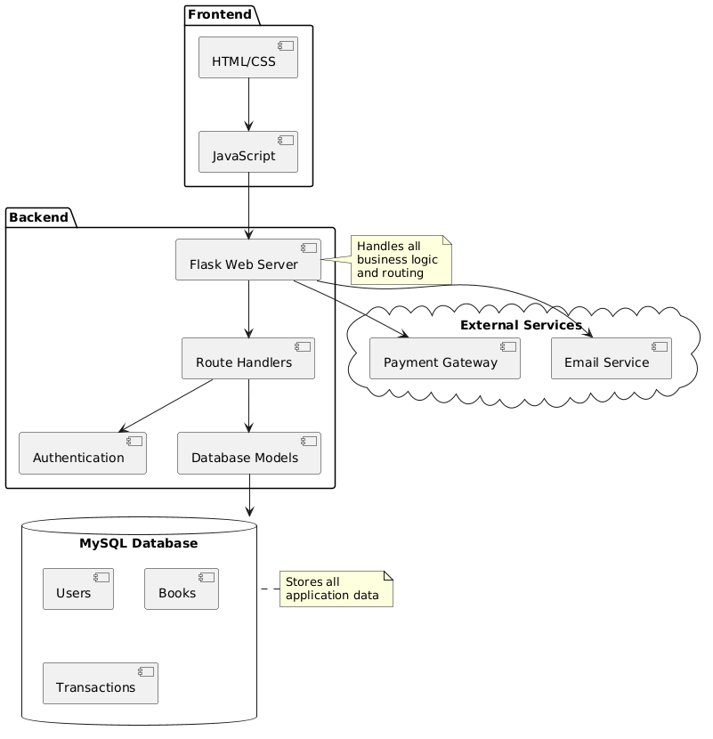

# Library Management System

A comprehensive web-based Library Management System built with Flask and MySQL, designed to streamline library operations and enhance user experience. This modern application provides an intuitive interface for both library administrators and users, facilitating efficient management of books, user accounts, and library transactions.

## Project Overview

The Library Management System is a full-stack web application that digitizes and automates traditional library operations. It combines robust backend functionality with a responsive, user-friendly frontend to create a seamless library management experience.

### Key Highlights

- **Dual User Interface**: Separate interfaces for administrators and regular users, each tailored to their specific needs and permissions
- **Real-time Inventory Management**: Live tracking of book availability, borrowing status, and purchase transactions
- **Automated Operations**: Streamlined processes for book borrowing, returns, and purchases
- **Smart Search System**: Advanced search functionality with filters for efficient book discovery
- **Secure Authentication**: Role-based access control with encrypted password storage
- **Transaction Tracking**: Comprehensive logging of all library operations

### Core Functionalities

1. **For Users**
   - Browse and search the digital library catalog
   - View detailed book information and availability
   - Borrow and return books electronically
   - Purchase books through integrated checkout
   - Track personal borrowing history
   - Manage profile and preferences
   - Shopping cart for book purchases

2. **For Administrators**
   - Comprehensive dashboard for library overview
   - Real-time monitoring of book circulation
   - User account management
   - Book inventory control
   - Transaction and payment processing
   - Generate reports and analytics
   - Category and metadata management

### Technical Innovation

The system leverages modern web technologies and best practices:
- **Responsive Design**: Bootstrap 5 ensures a seamless experience across all devices
- **Dynamic Updates**: AJAX calls for real-time data updates without page reloads
- **Secure Operations**: Parameterized queries and input validation prevent common vulnerabilities
- **Efficient Data Management**: Optimized database queries and connection pooling
- **Modular Architecture**: Well-structured codebase for easy maintenance and scalability

## Features

- **User Authentication**
  - User registration and login
  - Admin and regular user roles
  - Secure password hashing

- **Book Management**
  - Browse and search books
  - Book categories
  - Cover image support
  - Book details with descriptions

- **Library Operations**
  - Borrow books
  - Purchase books
  - Return borrowed books
  - Transaction history

- **Admin Dashboard**
  - Manage books (add, edit, delete)
  - User management
  - Monitor borrowed books
  - Track transactions
  - Generate reports

## Prerequisites

- Python 3.8 or higher
- MySQL 8.0 or higher
- pip (Python package manager)

## Database Connection

The project uses Flask-MySQLdb to establish a connection between the Flask application and MySQL database. The connection is configured using environment variables stored in the `.env` file, which keeps sensitive database credentials secure. In `app.py`, we initialize the MySQL connection using the Flask-MySQLdb extension, which creates a connection pool to efficiently manage database connections. Each database operation uses parameterized queries with `MySQLdb.cursors.DictCursor` to prevent SQL injection and return results as dictionaries. The application maintains a persistent connection throughout the session, automatically handling connection pooling and cleanup. Error handling is implemented to gracefully manage connection issues and ensure proper connection closure. For database schema management, we use `setup_db.py` which executes the SQL commands defined in `schema.sql` to create and initialize the database structure, including tables, relationships, and default data.

## System Architecture & Diagrams

### 1. System Architecture

<div style="text-align: center;">
    
    </div>

### 2. Database ER Diagram

<div style="text-align: center;">
    
    </div>

### 3. User Flow Diagram

<div style="text-align: center;">
    
    </div>

### 4. Security Architecture

<div style="text-align: center;">
    
    </div>

## Technical Details

### Backend (Python/Flask)

1. **Flask Framework**
   - `Flask`: Web framework for routing and request handling
   - `flask_mysqldb`: MySQL database integration
   - `Blueprint`: For modular application structure
   - `session`: User session management
   - `flash`: Flash message handling

2. **Security Features**
   - `SHA2`: Password hashing in MySQL
   - `@login_required`: Custom decorator for protected routes
   - `@admin_required`: Role-based access control
   - `werkzeug.security`: Additional security utilities

3. **Database Connectivity**
   - `MySQLdb.cursors`: Database cursor handling
   - `DictCursor`: Returns results as dictionaries
   - Connection pooling for efficient database operations
   - Parameterized queries to prevent SQL injection

4. **Environment Management**
   - `python-dotenv`: Environment variable management
   - `os`: Operating system interface
   - Environment-based configuration

### Frontend

1. **Templates (Jinja2)**
   - Template inheritance using `base.html`
   - Conditional rendering
   - Loop structures
   - Form handling
   - Flash message display

2. **CSS Framework**
   - Bootstrap 5.0
   - Custom CSS for specific components
   - Responsive design
   - Mobile-first approach

3. **JavaScript Libraries**
   - jQuery for DOM manipulation
   - DataTables for dynamic tables
   - Bootstrap JavaScript for components
   - Custom AJAX calls for async operations

4. **Components**
   - Navigation bar with dynamic links
   - Responsive cards for book display
   - Modal dialogs for confirmations
   - Form validation
   - Toast notifications

### Database Design

1. **MySQL Tables**
   ```sql
   - users
   - books
   - book_categories
   - borrowed_books
   - purchased_books
   - transactions
   - cart_items
   - refunds
   - admin_logs
   ```

2. **Key Relationships**
   - One-to-Many: Users to Borrowed Books
   - One-to-Many: Users to Purchased Books
   - Many-to-Many: Books to Categories
   - One-to-Many: Users to Transactions

3. **Database Features**
   - Foreign key constraints
   - Indexing for performance
   - Triggers for logging
   - Stored procedures for complex operations

### API Endpoints

1. **Authentication**
   ```python
   /login          # User login
   /register       # New user registration
   /logout         # User logout
   ```

2. **Book Operations**
   ```python
   /books              # List all books
   /books/search       # Search books
   /books/<id>         # View book details
   /books/borrow/<id>  # Borrow a book
   /books/return/<id>  # Return a book
   ```

3. **Admin Operations**
   ```python
   /admin/dashboard        # Admin dashboard
   /admin/books           # Manage books
   /admin/users           # Manage users
   /admin/transactions    # View transactions
   ```

4. **Cart & Purchase**
   ```python
   /cart               # Shopping cart
   /cart/add/<id>      # Add to cart
   /cart/remove/<id>   # Remove from cart
   /checkout           # Checkout process
   ```

### Key Python Functions

1. **Authentication**
   ```python
   def login():
       # Handles user authentication
       # Uses SHA2 password hashing
       # Manages user sessions

   @login_required
   def protected_route():
       # Decorator for protected routes
       # Checks session status
       # Redirects unauthorized access
   ```

2. **Database Operations**
   ```python
   def get_db():
       # Database connection handling
       # Connection pooling
       # Error handling

   def execute_query():
       # Safe query execution
       # Parameter sanitization
       # Result processing
   ```

3. **File Handling**
   ```python
   def upload_file():
       # Secure file upload
       # File type validation
       # Size restrictions

   def allowed_file():
       # File extension checking
       # Security validation
   ```

### Development Tools

1. **Version Control**
   - Git for source control
   - GitHub for repository hosting
   - Branch management for features

2. **Development Environment**
   - Visual Studio Code
   - MySQL Workbench
   - Python virtual environment
   - Flask Debug Toolbar

3. **Testing**
   - Unit tests for core functions
   - Integration tests for API endpoints
   - Database mock testing


## Installation

1. **Clone the repository**
   ```bash
   git clone <repository-url>
   cd library-management-system
   ```

2. **Create a virtual environment**
   ```bash
   python -m venv venv
   ```

3. **Activate the virtual environment**
   - Windows:
     ```bash
     venv\Scripts\activate
     ```
   - Linux/Mac:
     ```bash
     source venv/bin/activate
     ```

4. **Install dependencies**
   ```bash
   pip install -r requirements.txt
   ```

## Database Setup

1. **Create a .env file in the project root**
   ```
   MYSQL_HOST=localhost
   MYSQL_USER=your_username
   MYSQL_PASSWORD=your_password
   MYSQL_DB=elibrary
   SECRET_KEY=your_secret_key
   ```

2. **Create MySQL Database**
   ```sql
   CREATE DATABASE elibrary;
   ```

3. **Execute the schema**
   ```bash
   python setup_db.py
   ```
   This will:
   - Create all necessary tables
   - Set up default categories
   - Create default admin user

## Default Users

After setting up, you can login with these default credentials:

1. **Admin Account**
   - Username: admin
   - Password: admin123

2. **Test User Account**
   - Username: user
   - Password: user123

## Running the Application

1. **Start the Flask application**
   ```bash
   python app.py
   ```

2. **Access the application**
   - Open your web browser
   - Go to `http://127.0.0.1:5000`

## Project Structure

```
library-management-system/
├── app.py              # Main application file
├── setup_db.py         # Database setup script
├── schema.sql          # Database schema
├── requirements.txt    # Python dependencies
├── static/            # Static files (CSS, JS, images)
├── templates/         # HTML templates
│   ├── admin/        # Admin panel templates
│   └── ...           # Other templates
└── .env              # Environment variables
```

## Contributing

1. Fork the repository
2. Create a new branch (`git checkout -b feature/improvement`)
3. Make changes
4. Commit your changes (`git commit -am 'Add new feature'`)
5. Push to the branch (`git push origin feature/improvement`)
6. Create a Pull Request

## Security Features

- Password hashing using SHA-256
- Session-based authentication
- CSRF protection
- Input validation and sanitization
- Secure password storage

## License

This project is licensed under the MIT License - see the LICENSE file for details.
